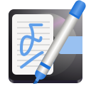

# Nickvision Tagger

**An easy-to-use music tag (metadata) editor**

# Features
TODO

# Screenshots
TODO

# Dependencies
- [C++20](https://en.cppreference.com/w/cpp/20)
- [Qt 6](https://www.qt.io/product/qt6)
- [curlpp](http://www.curlpp.org/)
- [jsoncpp](https://github.com/open-source-parsers/jsoncpp)
- [taglib](https://taglib.org/)

# Special Thanks
- [daudix-UFO](https://github.com/daudix-UFO) and [jannuary](https://github.com/jannuary) for our application icons
