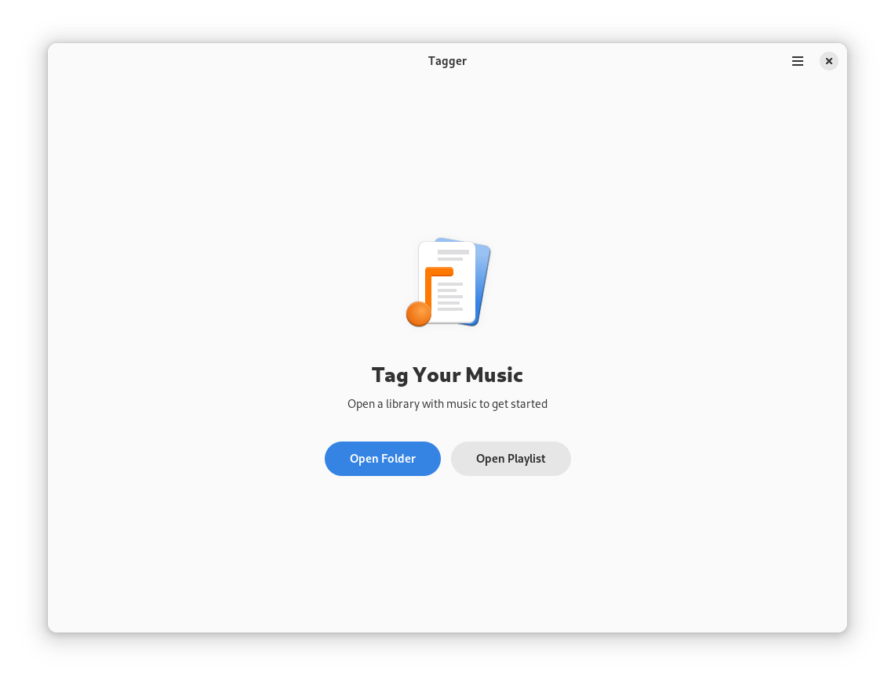
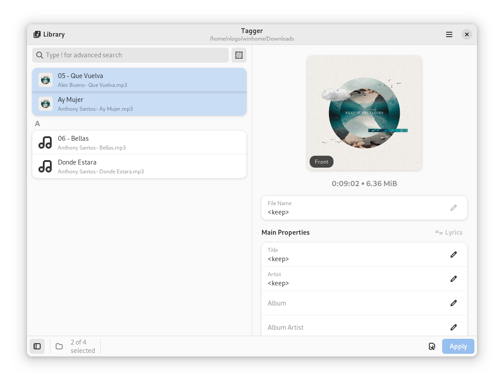
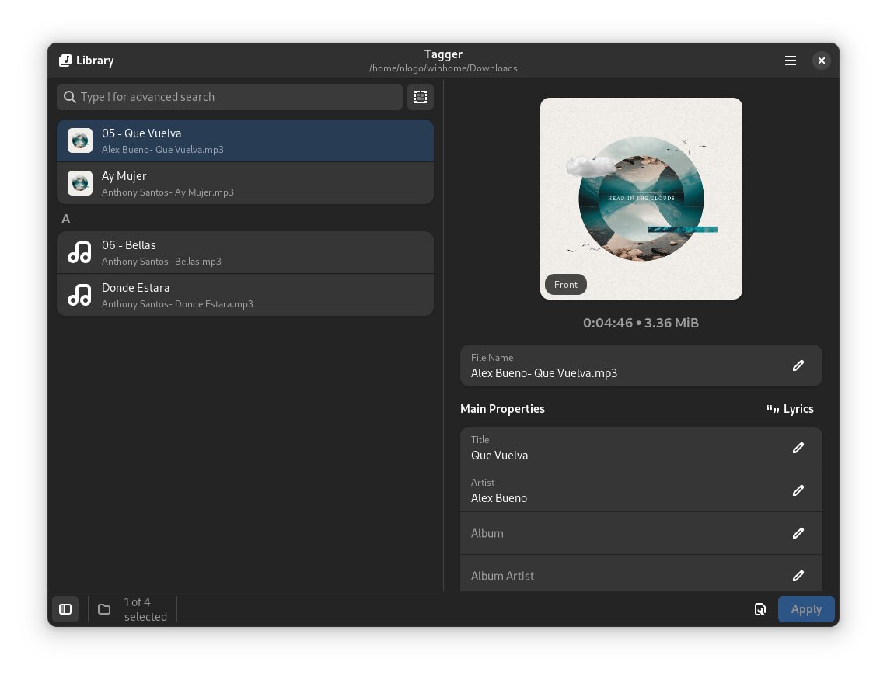

  ✨Powered by [Weblate](https://weblate.org/en/)✨

# Features
- Support for many music file types (mp3, ogg, flac, wma, wav, and more)
- Edit tags and album art of multiple files, even across subfolders, all at once
- Edit unsynchronized and synchronized lyrics for a file (with LRC import and export support)
- Convert filenames to tags and tags to filenames with ease
- Lookup file information using MusicBrainz
- Lookup lyric information using Music163 and Letras
- Open, manage, and create playlists in many formats (m3u, pls, xspf, and more)

# Installation

# Chat

# Contributing

See [CONTRIBUTING.md](CONTRIBUTING.md) for details on how can you help the project and how to provide information so we can help you in case of troubles with the app.

# Screenshots

 
GNOME

 
 
 
 
 

 
WinUI

 
 
 
 
 

# Dependencies
- [.NET 7](https://dotnet.microsoft.com/en-us/)
- [chromaprint](https://acoustid.org/chromaprint)

# Code of Conduct

This project follows the [GNOME Code of Conduct](https://wiki.gnome.org/Foundation/CodeOfConduct).
